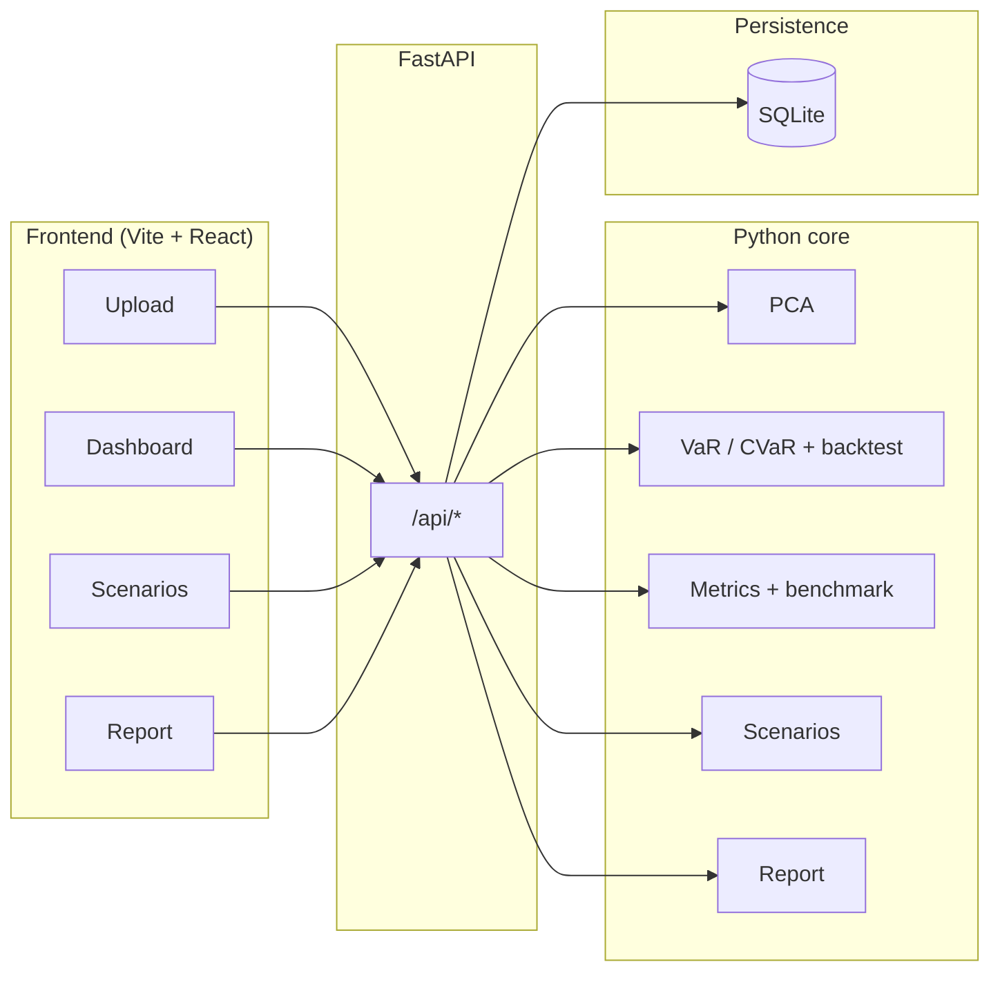
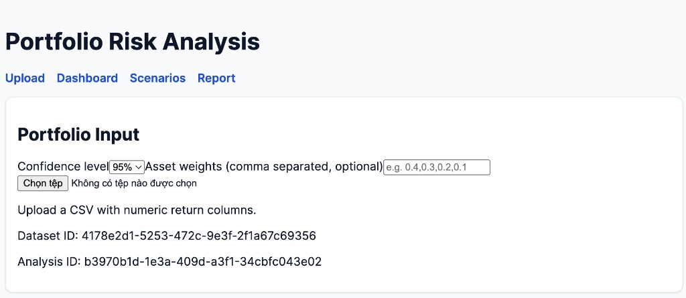
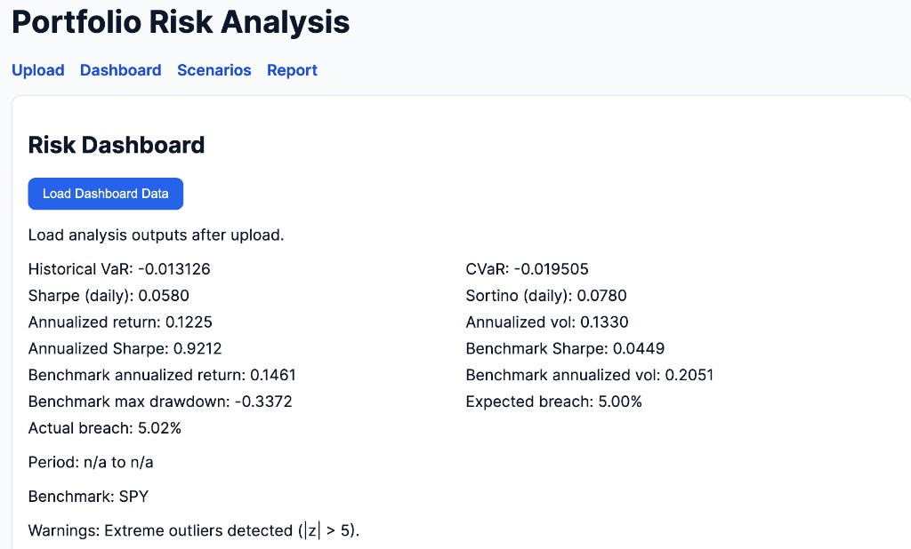
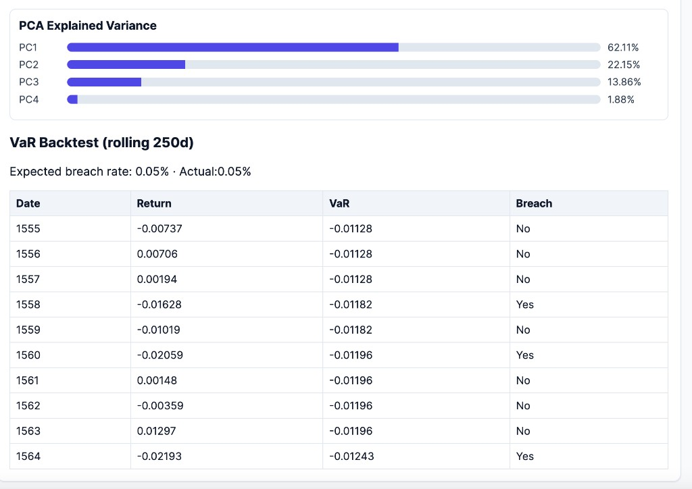
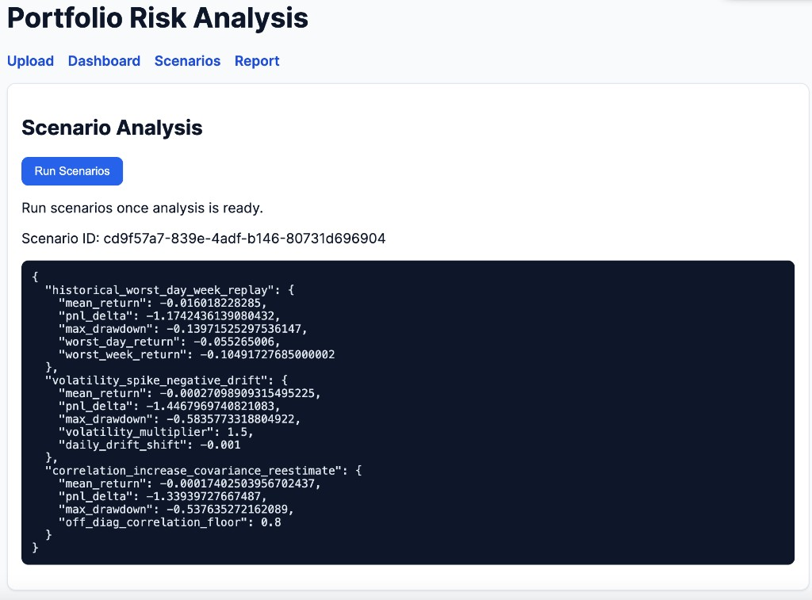
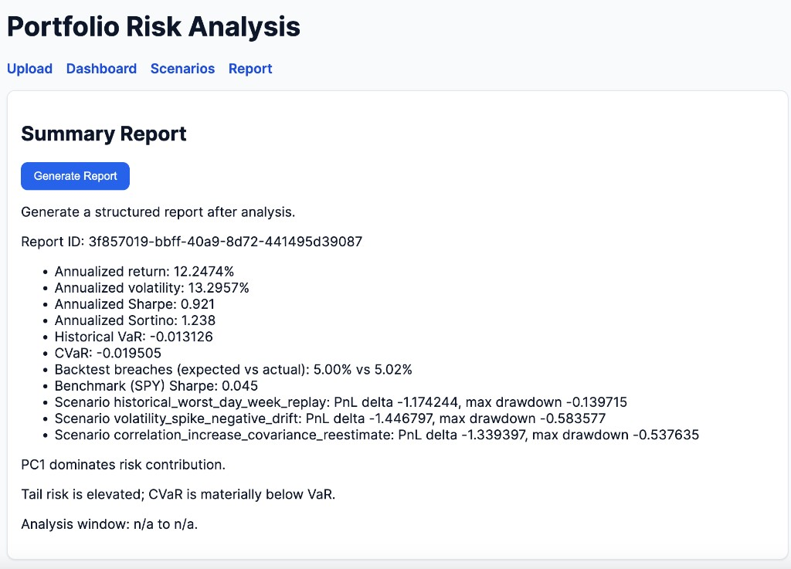

# Portfolio Risk Analysis

Reproducible pipeline for portfolio risk decomposition, tail-risk estimation, stress testing, and reporting: Python (FastAPI) and a React (Vite) dashboard.

Design goals: clear statistical choices, deterministic simulation where RNG is used (fixed seeds in scenarios), SQLite-backed run identifiers, and a desktop UI for PCA, VaR/CVaR, rolling VaR backtests, scenario output, and a short summary. Suitable for demos, teaching, or reviewing an end-to-end risk workflow.

## Table of contents

- [Why this project exists](#why-this-project-exists)
- [What is included](#what-is-included)
- [Methodology (quant-facing)](#methodology-quant-facing)
- [Architecture](#architecture)
- [Tech stack](#tech-stack)
- [Screenshots](#screenshots)
- [Repository layout](#repository-layout)
- [Quick start (local)](#quick-start-local)
- [API surface](#api-surface)
- [Deployment notes](#deployment-notes)
- [Testing](#testing)
- [Sample data](#sample-data)
- [Limitations and extensions](#limitations-and-extensions)
- [License](#license)
- [Disclaimer](#disclaimer)


## Why I built this project

Portfolio risk is usually multidimensional, not one headline number:

| Theme | Role in this project |
|--------|----------------------|
| Factor structure (PCA) | Linear decomposition of return covariance; loadings aid interpretation. Not an economic factor model. |
| Tail risk (VaR / CVaR) | Historical quantile VaR, Gaussian parametric VaR for comparison, CVaR-style tail averages beyond the VaR cut. |
| Backtesting | Rolling (e.g. 250-day) historical VaR; expected vs. actual breach rates as a rough calibration check. |
| Scenarios | Stressed paths when volatility or effective correlations move; parameters, PnL delta vs. baseline, max drawdown. |

Flow: upload returns, run analysis, use the dashboard, run scenarios, generate a report. Warnings and assumptions are exposed in the UI where applicable.

---

## What is included

| Area | Implementation |
|------|----------------|
| Data | CSV of numeric return columns; optional `Date` and sorted index; optional comma-separated weights. |
| PCA | Full PCA (scikit-learn); explained variance ratios and loadings. |
| Tail risk | Historical VaR, parametric VaR, CVaR; breach rate vs. expected tail mass; rolling VaR backtest with `backtest_points` for charts. |
| Performance | Mean/vol, Sharpe / Sortino (daily and annualized), max drawdown, rolling volatility. |
| Benchmarking | vs. a benchmark column when present (e.g. SPY in the CSV). |
| Scenarios | Worst day/week replay; vol spike with negative drift; correlation floor with covariance re-estimate and deterministic multivariate normal draws (numpy, fixed seed). |
| Reporting | Highlights and short text from stored analysis and scenarios. |
| Persistence | SQLite for datasets, analyses, scenario runs, reports. |
| Operations | `GET /api/health`, `GET /api/ready`. |

---

## Methodology (quant-facing)

Parametric (Gaussian) VaR is an assumption, not ground truth. This matches the code.

### PCA

- Fit on the asset return matrix.
- Outputs: explained variance ratio per component and loadings (weights on original assets).
- PC1 often reflects broad co-movement when correlations are positive; higher PCs are residual. Exploratory use only.

### VaR and CVaR

- Historical VaR at confidence \(c\): empirical quantile at tail probability \(1 - c\).
- Parametric VaR: \(\mu + z_{1-c} \sigma\) from sample mean, sample volatility, normal quantile—contrast with historical VaR when tails are non-Gaussian.
- CVaR: mean of returns in the tail beyond the historical VaR (empirical expected-shortfall style).

### Rolling VaR backtest

- Rolling-window historical VaR (250-day window in code when enough history exists).
- Breach: realized return below that day’s VaR.
- Expected breach rate ≈ nominal tail mass (e.g. ~5% at 95% confidence).
- Actual breach rate: diagnostic only, not regulatory sign-off.

### Scenarios

1. `historical_worst_day_week_replay`: path from worst realized daily/weekly portfolio returns.
2. `volatility_spike_negative_drift`: scaled returns with negative drift adjustment.
3. `correlation_increase_covariance_reestimate`: correlation floor on off-diagonals, new covariance, multivariate normal paths with fixed seed.

Each reports PnL delta vs. baseline and max drawdown on the stressed series.

## Architecture



Thin HTTP layer; analytics in `backend/app/core/`; orchestration and storage in `backend/app/services/`; fixed seeds in simulation; UI is presentation only.

## Tech stack

| Layer | Technology |
|-------|------------|
| Frontend | React 18, Vite 5, TypeScript, React Router, Axios, Tailwind CSS |
| Backend | Python 3.11+ (3.12 in `render.yaml` for Render), FastAPI, Uvicorn, Pydantic |
| Numerics | NumPy, pandas, SciPy, scikit-learn |
| Storage | SQLite (JSON payloads) |
| Tests | pytest (backend); TypeScript build + ESLint (frontend) |

## Screenshots

### 1. Portfolio input

Upload returns, confidence level, optional weights. Dataset and analysis IDs tag each run.



### 2. Risk dashboard

VaR/CVaR, breach rates, annualized metrics, benchmark when applicable.



### 3. PCA and VaR backtest

Explained variance by component and rolling VaR backtest table.



### 4. Scenario analysis

JSON: parameters, PnL delta, max drawdown.



### 5. Summary report

Metrics, scenario lines, short interpretation.




## Repository layout

```
.
├── backend/
│   ├── app/
│   │   ├── api/           # REST routes
│   │   ├── core/          # PCA, risk, metrics, scenarios, report
│   │   └── services/      # Orchestrator, SQLite store
│   ├── data/              # Local DB (gitignored) + sample CSV (tracked)
│   ├── tests/
│   ├── requirements.txt
│   └── .env.example
├── frontend/
│   ├── src/
│   ├── public/
│   ├── package.json
│   ├── package-lock.json
│   ├── vite.config.ts
│   └── .env.example
├── readme_images/
├── tools/
├── scripts/
├── render.yaml
├── LICENSE
└── README.md
```


## Quick start (local)

Backend (from repo root):

```bash
cd backend
pip install -r requirements.txt
uvicorn app.main:app --reload
```

API base: `http://127.0.0.1:8000`, routes under `/api`.

Frontend:

```bash
cd frontend
npm install
npm run dev
```

From `frontend/.env.example`, set e.g.:

```bash
VITE_API_BASE_URL=http://127.0.0.1:8000
```

CORS: backend `ALLOWED_ORIGINS` (comma-separated); defaults include `http://localhost:5173`.

## Testing

```bash
cd backend && pytest
cd frontend && npm run build && npm run lint
```

## Sample data

- `backend/data/sample_returns_public.csv`

Do not commit local SQLite under `backend/data/`; recreate by running the app.

## Limitations 

Not in scope as shipped: regulatory-grade submissions; GARCH / stoch vol / copulas / EVT; live data or execution.

Extensions: EWMA or multivariate GARCH covariance; block or filtered historical simulation; optimization in a separate module.


## License

[MIT License](LICENSE).

Copyright 2024–2026. See `LICENSE` for the full notice.


## Disclaimer

For education, research, and demonstration only. Not investment advice, not regulatory filing output, not a replacement for production risk systems. Validate methods and data for your own use.
